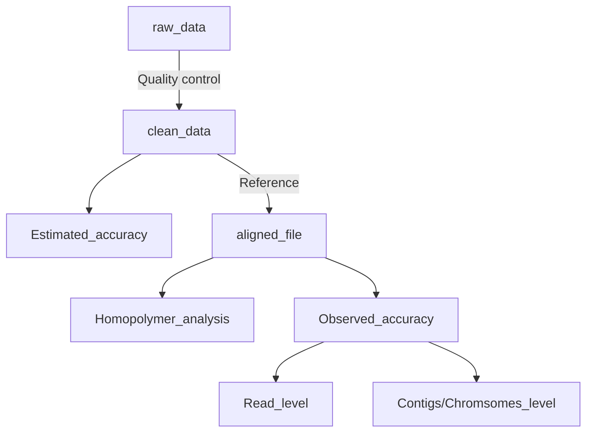

**Giraffe_View** is designed to help access and visualize the accuracy of a reads dataset, specifically for Oxford Nanopore Technologies (ONT) long-read sequencing.

**Workflow**

```mermaid
graph TD
raw_data --> |Quality control| clean_data
clean_data --> Estimated_accuracy
clean_data --> |Reference| aligned_file 
aligned_file --> Homopolymer_analysis
aligned_file --> Observed_accuracy
Observed_accuracy --> Read_level
Observed_accuracy --> Contigs/Chromsomes_level
```
