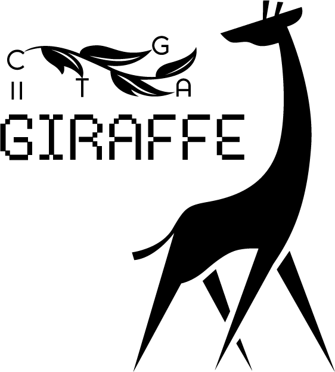
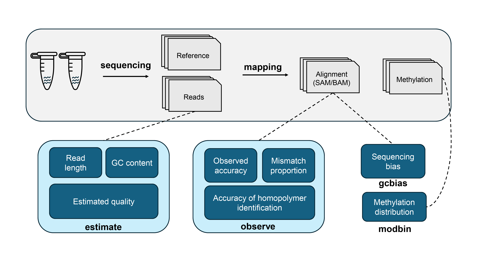

#  Giraffe
<a href="https://pypi.org/project/Giraffe-View/" rel="pypi"></a> <a href="https://opensource.org/license/mit/" rel="license"></a>

**Giraffe** is specially designed to provide a comprehensive assessment of the accuracy of long-read sequencing datasets obtained from both the Pacific Biosciences (PacBio) and Oxford Nanopore Technologies (ONT) platforms, offering four distinct functions.



`estimate`   Calculation of estimated read accuracy (Q score), length, and GC content.

`observe`     Calculation of observed read accuracy, mismatch proportion, and homopolymer identification (e.g. AAAA).

`gcbias`       Calculation of the relationship between GC content and sequencing depth.

`modbin`       Calculation of the distribution of modification (e.g. 5mC or 6mA methylation) at the regional level.


# Installation

## Installation by [Conda](https://conda.io/projects/conda/en/latest/index.html)

```shell
# install on the current environment
conda install -c raymond_liu giraffe_view -y

# install on a new environment
conda create -n giraffe -c raymond_liu giraffe_view -y
```


## Installation by [PyPI](https://pypi.org/)

Before using this tool, you need to install additional dependencies for read processing, including the [samtools](https://www.htslib.org/)，[minimap2](https://github.com/lh3/minimap2), and [bedtools](https://github.com/arq5x/bedtools2). The following commands can help you install both the software package and its dependencies.

```shell
# Testing version
# samtools 1.17
# minimap2 2.17-r941
# bedtools 2.30.0

# install on the currently environment
conda install -c bioconda -c conda-forge samtools minimap2 bedtools -y

# install on a new environment
conda create -n giraffe -c bioconda -c conda-forge python==3.9 samtools==1.17 minimap2==2.17 bedtools==2.30.0 -y && conda activate giraffe
```

To install this tool, please use the following command.
```shell
pip install Giraffe-View
```


# Quick usage

 **Giraffe** can be run with a one-button command or by executing individual functions.

## ONE-button pattern

```shell
# Running function of "estimate", "observe", and "gcbias" with FASTQ files
giraffe --read <read table> --ref <reference> --cpu <number of processes or threads>

# Running function of "estimate", "observe", and "gcbias" with unaligned SAM/BAM files
giraffe --read <unaligned SAM/BAM table> --ref <reference> --cpu <number of processes or threads>

# Example for input table (sample_ID data_type file_path)
sample_A ONT /home/user/data/S1.fastq
sample_B ONT /home/user/data/S2.fastq
sample_C ONT /home/user/data/S3.fastq
...
```

 Here the data_type can be ONT DNA reads (ONT), ONT directly sequencing reads (ONT_RNA), and Pacbio DNA reads (Pacbio).


## Estimate function

```shell
# For the FASTQ reads
giraffe estimate --read <read table> 

# For the unaligned SAM/BAM files
giraffe estimate --unaligned <unaligned SAM/BAM table>
```


## Observe function

```shell
# For FASTQ reads
giraffe observe --read <read table> --ref <reference>

# For unaligned SAM/BAM files
giraffe observe --unaligned <unaligned SAM/BAM table> --ref <reference>

# For aligned SAM/BAM files
giraffe observe --aligned <aligned SAM/BAM table>
```

**Note:** If you are going to use aligned SAM/BAM files as input, please remove the secondary alignment (**--secondary=no**) and add the MD tag (**--MD**) before mapping by adding these two highlighted parameters.


## GCbias function

```shell
giraffe gcbias --ref <reference> --aligned <aligned SAM/BAM table>
```


## Modbin function

```shell
giraffe modbin --methyl <methylation table> --region <target region>

# Example for methylation file (Chrom Start End Value):
contig_A 132 133 0.92
contig_A 255 256 0.27
contig_A 954 955 0.52
...
```


# Example

Here, we provide demo datasets for testing the **Giraffe**. The following commands can help to download them and run the demo.

```shell
giraffe_run_demo
```

The demo datasets included three E. coli datasets including a 4.2 MB reference, 79 MB R10.4.1 reads, and 121 MB R9.4.1 reads. For the methylation files, two files of zebrafish blood (23 MB)and kidney (19 KB) are included. This demo takes about 7 minutes and  20 seconds with a maximum memory of 391 MB. This running includes the one-command pattern and four individual functions testing.


# Tool showcase

The one-command pattern will generate a summary in [HTML](https://lxd98.github.io/giraffe.github.io) format. If the scale of the X/Y-axis is not reasonable, the script of `giraffe_plot`  can be used to replot the figure.

# Documentation

For more details about the usage of Giraffe and results profiling, please refer to the [document](https://giraffe-documentation.readthedocs.io/en/latest).


