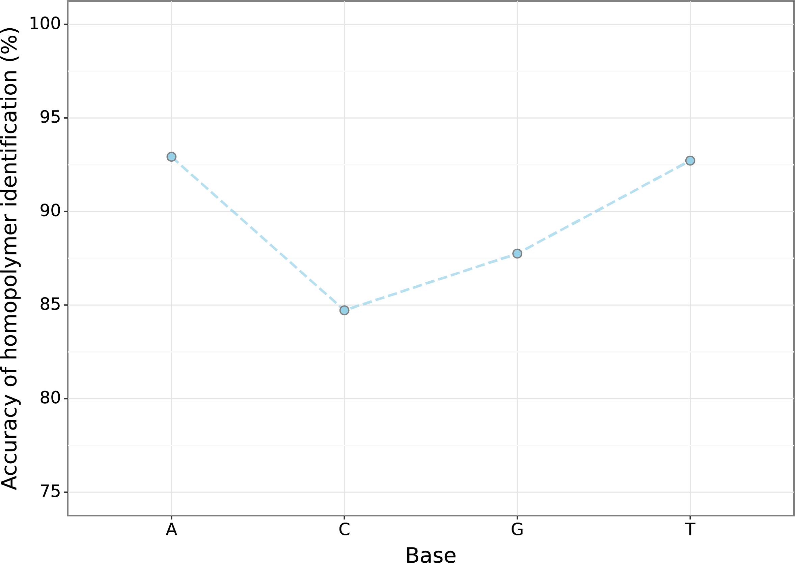
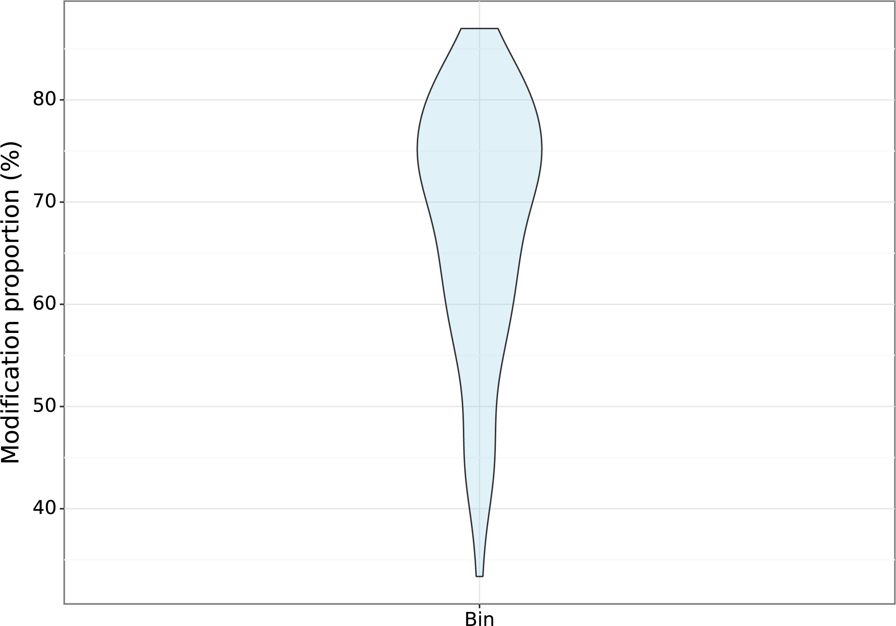
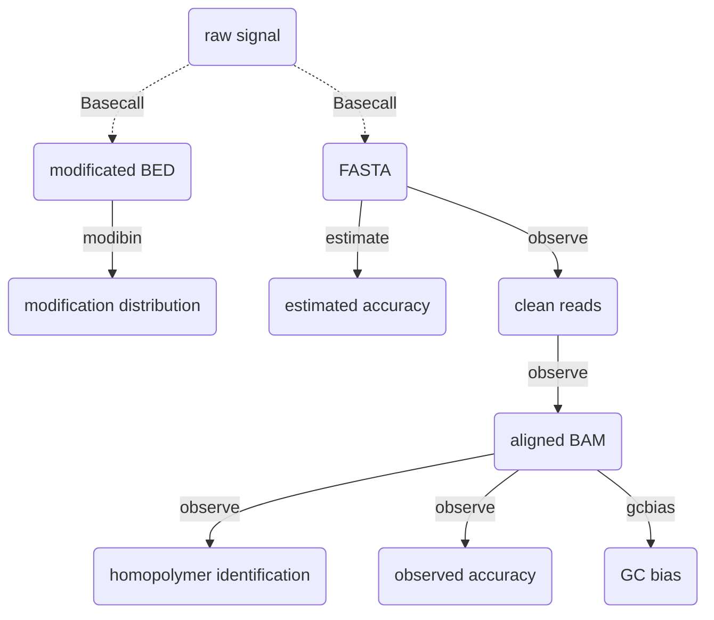

# Giraffe_View 

**Giraffe_View** is designed to help assess and visualize the accuracy of a sequencing dataset, specifically for Oxford Nanopore Technologies (ONT) long-read sequencing including DNA and RNA data. There are four main functions to validate the read quality.

- `observe`  calculates the observed accuracy, mismatches porportion, and homopolymer identification.
- `estimate`  calculates the estimated accuracy, which is equal to Quality Score.
- `gcbias`  compares the relationship between GC content and read coverage.
- `modibin` performs statistics on the distribution of modification based on the bed file.


## Installation

To use this software, you'll need to install additional tools for read processing, including samtools, seqkit，minimap2, and bedtools. The following commands can help you install both the software package and its dependencies.

```shell
pip install Giraffe-View
conda install -c bioconda -c conda-forge samtools minimap2 seqkit bedtools -y
```


## General Usage

giraffe can be run using these simple commands:

```
giraffe -h
usage: giraffe [-h] {observe,estimate,gcbias,modibin} ...

A tool to help you assess quality of ONT data.

positional arguments:
  {observe,estimate,gcbias,modibin}
    observe             Observed quality in accuracy, mismatch, and homopolymer identification
    estimate            Estimated read accuracy
    gcbias              Relationship between GC content and depth
    modibin             Average modification proportion of bins

optional arguments:
  -h, --help            show this help message and exit
```


The available sub-commands are:

#### observe

```
giraffe observe -h
usage: giraffe observe [-h] --input <fastq> --ref <reference> [--cpu <number>] [--plot]

optional arguments:
  -h, --help         show this help message and exit
  --input <fastq>    input reads
  --ref <reference>  input reference
  --cpu <number>     number of cpu (default:10)
  --plot             Results visualization
```

- `fastq` - raw FASTQ data, some filtering steps will be performed, including removal of short reads (length < 200 bp) and low-quality reads (Q value < 7).
- `reference` - reference file in FASTA format.
- `cpu` - number of CPUs will be used during processing.


#### estimate  

```
giraffe estimate -h
usage: giraffe estimate [-h] --input <fastq> [--cpu <number>] [--plot]

optional arguments:
  -h, --help       show this help message and exit
  --input <fastq>  input reads
  --cpu <number>   number of cpu (default:10)
  --plot           Results visualization
```

- `fastq` - FASTQ data.


#### gcbias

```
giraffe gcbias -h
usage: giraffe gcbias [-h] --ref <reference> --input <sam/bam> [--binsize] [--plot]

optional arguments:
  -h, --help         show this help message and exit
  --ref <reference>  input reference file
  --input <sam/bam>  input bam/sam file
  --binsize          input bin size (default:1000)
  --plot             Results visualization
```

- `reference` - the reference file in FASTA format.
- `sam` / `bam` - the result  SAM/ BAM file. If you have used the observe function to process your data, the resulting `tmp.sort.bam` file can be used as the input.
- `binsize` - the length of BIN. The BIN is the unit to count the read coverage and GC content.


#### modibin

```
giraffe modibin -h
usage: giraffe modibin [-h] --input <bed> --ref <reference> [--cpu <number>] [--plot]

optional arguments:
  -h, --help         show this help message and exit
  --input <bed>      input modificated bed file, please use the .bed as the file suffix
  --ref <reference>  input position file with CSV format, please use the .csv as the file suffix
  --cpu <number>     number of cpu (default:10)
  --plot             Results visualization
```

- `bed` -  a BED file with four columns (three columns for position, one for methylation value).  Please use the tab ("\t") to gap the column instead of the space (" ").

   ```
   #chrom	start	end	value
   chr1	81	83	0.8
   chr1	21314	21315	0.3
   chr1	32421	32422	0.85
   ```

- `reference` - a CSV file with target regions (chromosome, start, end, ID)

   ```
   chr1,0,100000,1_0_100000
   chr1,100000,200000,1_100000_200000
   ```


## Results 

if you run the demo data in the example, you will obtain a fold named **results** with following structure.

```
results/
├── estimated_quality
│   ├── estimated_read_accuracy.pdf
│   └── final_estimated_accuracy.txt
├── GC_bias
│   ├── BIN.bed
│   ├── bin_distribution.pdf
│   ├── BIN.dp
│   ├── final_GC_bias_nor.txt
│   ├── GC_bias.pdf
│   ├── GC_bias_raw.txt
│   └── GC_content.txt
├── observed_quality
│   ├── clean.fastq
│   ├── final_homo_summary.txt
│   ├── final_observed_accuracy.txt
│   ├── homo_tmp.txt
│   ├── homo.txt
│   ├── Observed_homopolymer_identification.pdf
│   ├── Observed_mismatch_proportion.pdf
│   ├── Observed_read_accuracy.pdf
│   ├── tmp.sort.bam
│   └── tmp.sort.bam.bai
└── regional_modification
    ├── motif_bin_box.pdf
    ├── motif_bin_violin.pdf
    └── zebraFish_5mC_zebraFish_promoter.bed
```


### estimated_quality

- `final_estimated_accuracy.txt` - File with read ID, estimated accuracy, estimate error rate, and Q-Score for each read.
- `estimated_read_accuracy.pdf` -  Visualization of estimated accuracy.


>


### observed_quality

- `clean.fastq` - Filtered data, which used for downstream analysis.

- `tmp.sort.bam` - BAM file generated by aligning the filtered data against the reference genome.

- `tmp.sort.bam.bai` - Index for BAM file.

- `homo.txt` - Detailed information for homopolymer identification includes the chromosome, start position, end position, homopolymer  length, base type of homopolymer, matched base number, deleted base number, inserted base number, substituted base number, and read ID for each read.

- `homo_tmp.txt` - Summarized information includes the position of homopolymer in reference,  the number of perfectly matched reads, the total number of mapped read, and the homopolymer feature. 

- `final_observed_accuracy.txt` - Summary of observed accuracy includes the read ID, insertion length, deletion length, substitution length, matched length, observed identification rate, and observed accuracy for each read.
- ` final_homo_summary.txt` - Accuracy of homopolymer for each base type.

- `Observed_homopolymer_identification.pdf` - Visualization of accuracy of homopolymer identification.

- `Observed_mismatch_proportion.pdf` - Visualization of mismatch proportion.

- `Observed_read_accuracy.pdf` - Visualization of observed accuracy.


>

>

>


### GC_bias

- `BIN.bed` - BIN position (chromosome, start, end) .

- `BIN.dp` - Base depth for each BIN.

- `GC_content.txt`  - GC content for each BIN.

- `GC_bias_raw.txt`  - Average depth and BIN number for each GC content.

- `final_GC_bias_nor.txt` - Normalized read coverage for selected GC content.

- `bin_distribution.pdf` - Visualization of number of BINs for each GC content.

- `GC_bias.pdf` - Visualization of relationship between normalized depth and GC content.


>

>


### regional_modification

- `zebraFish_5mC_zebraFish_promoter.bed` - Average modification proportion for each BIN. Here, it is the average 5mC proportion at promoter level. 

- `motif_bin_violin.pdf` - Distribution of modification proportion.

- `motif_bin_box.pdf` - Box plot of  modification proportion.


>

>


## Workflow




## Developing

- run the homopolymer identification with multi processes.
