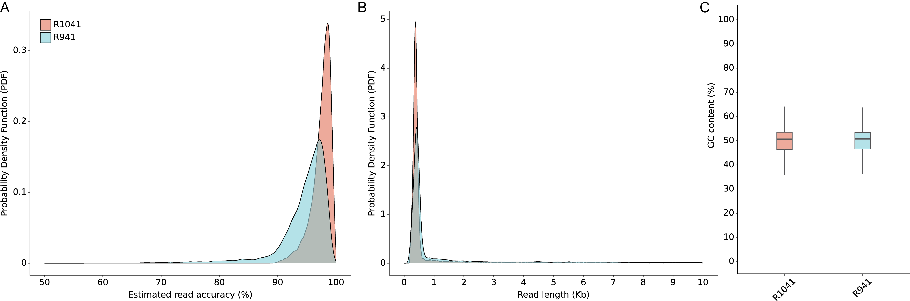
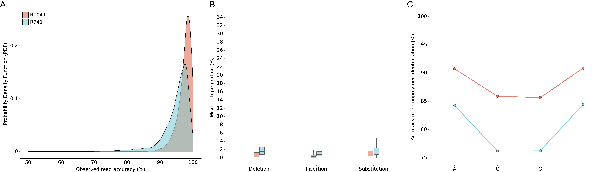
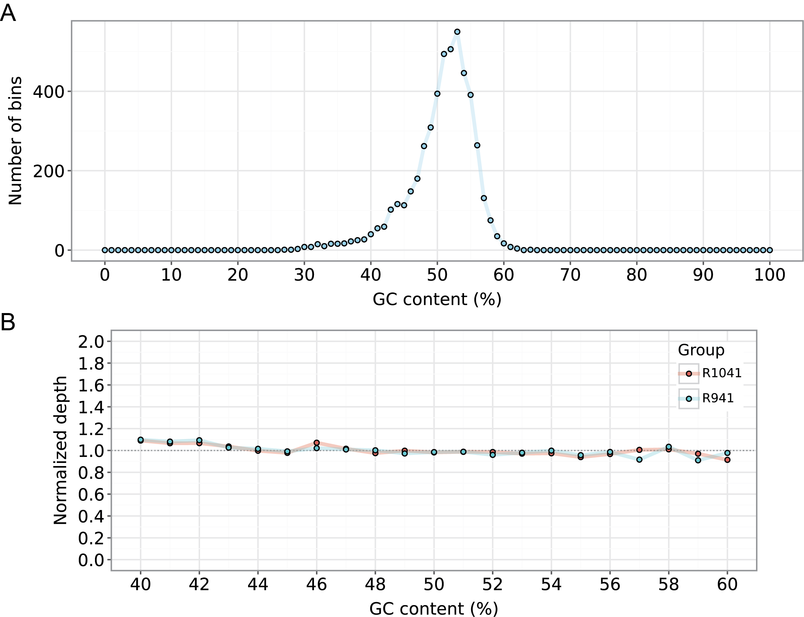
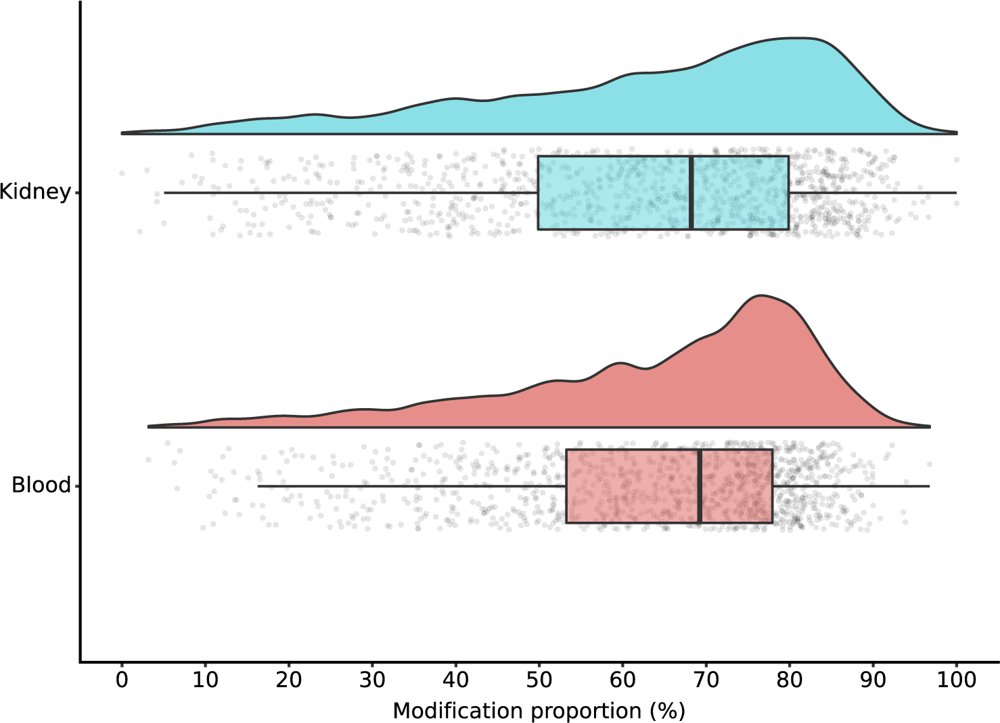
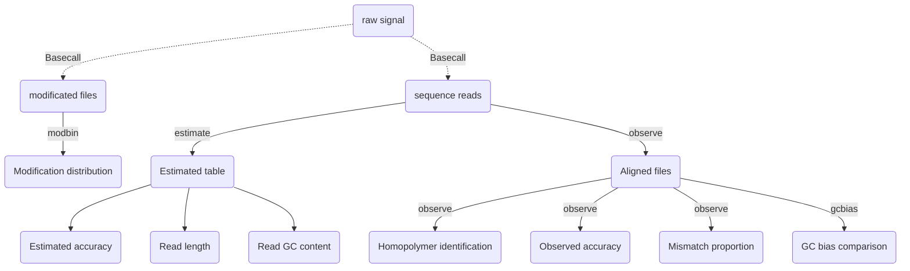

# Giraffe View

**Giraffe_View** is specially designed to provide a comprehensive assessment of the accuracy of long-read sequencing datasets obtained from both the PacBio and Nanopore platforms. 


- `estimate`  Calculation of estimated read accuracy (Q score), length, and GC content. 

- `observe`  Calculation of observed read accuracy, mismatch proportion, and homopolymer identification (e.g. AAAA).
- `gcbias`  Calculation of the relationship between GC content and sequencing depth.
- `modbin` Calculation of the distribution of modification (e.g. 5mC or 6mA methylation) at the regional level.


# Installation

Before using this tool, you need to install additional dependencies for read processing, including the [samtools](https://www.htslib.org/)，[minimap2](https://github.com/lh3/minimap2), and [bedtools](https://github.com/arq5x/bedtools2). The following commands can help you install both the software package and its dependencies.

```shell
conda install -c bioconda -c conda-forge samtools minimap2 bedtools -y
pip install Giraffe-View
```

If you are unfamiliar with the process of installing `conda`, you can refer to the official conda documentation for detailed instructions. Please follow [this link](https://conda.io/projects/conda/en/latest/user-guide/install/index.html) for guidance on installing conda.


# General Usage

The `giraffe` can be run using the following commands.

## estimate  

```shell
giraffe estimate --input {read_list.txt} --cpu 4 --plot 
```

`read_list.txt` - a table with your sample ID, sequencing platforms (**ONT/Pacbio**), and path of your sequencing reads (**FASTQ** format).

```python
# A demo of read_list.txt
# Note: please use the SPACE(" ") to gap them.
R1 ONT /home/user/test/reads/S1.fastq
R2 Pacbio /home/user/test/reads/S2.fastq
R3 ONT /home/user/test/reads/S3.fastq
```


## observe

```shell
giraffe observe --input {read_list.txt} --ref {genome.fa} --cpu 4 --plot 
```

`read_list.txt` -  a table the same as the above one.


## gcbias

```shell
giraffe gcbias --input {bam_list.txt} --ref {genome.fa} --plot 
```

`bam_list.txt` -  a table with your sample ID, sequencing platforms, and path of your alignment files (**sam/bam** format).

```python
# A demo of bam_list.txt
# Note: please use the SPACE(" ") to gap them.
# If you have used the observe function to process your data, the resulting bam files can be used as the input.
R1 ONT /home/user/test/Giraffe_Results/2_Observed_quality/S1.bam
R2 Pacbio /home/user/test/Giraffe_Results/2_Observed_quality/S2.bam
R3 ONT /home/user/test/Giraffe_Results/2_Observed_quality/S3.bam
```


## modbin

```shell
giraffe modbin --input {methylation_list.txt} --pos {promoter.csv} --cpu 4 --plot
```

`bam_list.txt` -  a table with your sample ID, sequencing platforms, and path of your methylation profiling files (**bed** format).

```python
# A demo of methylation_list.txt
# Note: please use the SPACE(" ") to gap them.
R1 ONT test/reads/5mC_S1.txt
R2 Pacbio test/reads/5mC_S2.txt
R3 ONT test/reads/5mC_S3.txt

# A demo of your methylation file (e.g. 5mC_S1.txt).
# Please use the tab ("\t") to gap the column.
# chromosome start end methylation_proportion
chr1	81	83	0.8
chr1	21314	21315	0.3
chr1	32421	32422	0.85

# A demo of promoter.csv
#chromosome, start, end, geneID
chr1,12027,17027,ENSDARG00000099104
chr1,6822,11822,ENSDARG00000102407

# Note: there is no Header for all tables.
```


# Example

Here, we provide demo datasets for testing the `giraffe`. The following commands can help to download them.

```shell
# The input file list
wget https://figshare.com/ndownloader/files/44967445 -O fastq.list
wget https://figshare.com/ndownloader/files/44967442 -O bed.list
wget https://figshare.com/ndownloader/files/44967499 -O bam.list

# The reference and ONT reads (R10.4.1 and R9.4.1) of E.coli
wget https://figshare.com/ndownloader/files/44967436 -O Read.tar.gz

# The 5mC methylation files of zebrafish blood and kidney samples.
# The position file is the gene promoter region in chromosome 1. 
wget https://figshare.com/ndownloader/files/44967427 -O Methylation.tar.gz

tar -xzvf Read.tar.gz
tar -xzvf Methylation.tar.gz
rm Read.tar.gz Methylation.tar.gz
```

Please run the following commands to start data analysis!

```shell
giraffe estimate --input fastq.list --plot --cpu 4
giraffe observe --input fastq.list --plot --cpu 4 --ref Read/ecoli_chrom.fa
giraffe gcbias --input bam.list --plot --ref Read/ecoli_chrom.fa
giraffe modbin --input bed.list --cpu 4 --plot --bed Methylation/zf_promoter.db
```


# Results 

if you run the demo data in the example, you will obtain a fold named **Giraffe_Results** with the following structure.

```shell
Giraffe_Results/
├── 1_Estimated_quality
│   ├── 1_Read_accuracy.pdf
│   ├── 2_Read_length.pdf
│   ├── 3_Read_GC_content.pdf
│   └── Estimated_information.txt
├── 2_Observed_quality
│   ├── 1_Observed_read_accuracy.pdf
│   ├── 2_Observed_mismatch_proportion.pdf
│   ├── 3_Homoploymer_summary.pdf
│   ├── Homoploymer_summary.txt
│   ├── Observed_information.txt
│   ├── R1041.bam
│   ├── R1041.bam.bai
│   ├── R1041_homopolymer_detail.txt
│   ├── R1041_homopolymer_in_reference.txt
│   ├── R941.bam
│   ├── R941.bam.bai
│   ├── R941_homopolymer_detail.txt
│   └── R941_homopolymer_in_reference.txt
├── 3_GC_bias
│   ├── 1_Bin_distribution.pdf
│   ├── 2_Relationship_normalization.pdf
│   ├── Bin_distribution.txt
│   ├── R1041_relationship_raw.txt
│   ├── R941_relationship_raw.txt
│   └── Relationship_normalization.txt
└── 4_Regional_modification
    ├── 1_Regional_modification.pdf
    ├── Blood.bed
    └── Kidney.bed
```


## 1_Estimated_quality

- `Estimated_information.txt` -  File with read ID, estimated read accuracy, estimate read error, Q Score, GC content, read length and sample ID.

  |  ReadID   | Accuracy | Error | Q_value | Length | GC_content | Group |
  | :-------: | :------: | :---: | :-----: | :----: | :--------: | :---: |
  | @9154e0a0 |  0.935   | 0.065 | 11.857  |  316   |   0.503    | R1041 |
  | @fa8f2a80 |  0.948   | 0.052 | 12.877  |  9621  |   0.498    | R1041 |

- `1_Read_accuracy.pdf` - Distribution of estimated read accuracy **(Fig A)**.

- `2_Read_length.pdf` - Distribution of read length **(Fig B)**.

- `3_Read_GC_content.pdf` - Distribution of read GC content **(Fig C)**.




## 2_Observed_quality

- `Homoploymer_summary.txt` - Accuracy of identification for each homopolymer type (only the length over 3 base pair was calculated, e.g. AAAA and TTTTT).

  | Base | Accuracy | Group |
  | :--: | :------: | :---: |
  |  T   |  0.909   | R1041 |
  |  G   |  0.857   | R1041 |
  |  A   |  0.907   | R1041 |
  |  C   |  0.859   | R1041 |

  

- `Observed_information.txt` - Summary of observed accuracy includes the read ID, insertion length, deletion length, substitution length, matched length, observed identification rate, observed accuracy, and sample ID for each read.

  |    ID    | Ins  | Del  | Sub  | Mat  |  Iden  |  Acc   | Group |
  | :------: | :--: | :--: | :--: | :--: | :----: | :----: | :---: |
  | 70fbffe6 |  3   |  1   |  1   | 354  | 0.9972 | 0.9861 | R1041 |
  | 96a5c10b |  3   |  11  |  2   | 342  | 0.9942 | 0.9553 | R1041 |

- `XXX_homopolymer_detail.txt` - Detailed information for homopolymer identification includes the chromosome, start position, end position, homopolymer  length, homopolymer type , matched base number, deleted base number, inserted base number, substituted base number, read ID, and sample ID (Read level).

  |    Chrom    | Start | End  | length | type | Matched base | Deleted base | Inserted base | Substituted  base |  ReadID  | SampleID |
  | :---------: | :---: | :--: | :----: | :--: | :----------: | :----------: | :-----------: | :---------------: | :------: | :------: |
  | ecoli_chrom | 3083  | 3086 |   4    |  T   |      4       |      0       |       0       |         0         | c322bcea |   R941   |
  | ecoli_chrom | 3382  | 3386 |   5    |  A   |      5       |      0       |       0       |         0         | c322bcea |   R941   |

- `XXX_homopolymer_in_reference.txt` - Summarized information includes the position of homopolymer in reference,  the number of perfectly matched read, the total number of mapped read, the homopolymer feature, and sample ID (Reference level). 

  |          pos          | num_of_mat | depth | type | Group |
  | :-------------------: | :--------: | :---: | :--: | :---: |
  | ecoli_chrom_3083_3086 |     1      |   1   |  4T  | R941  |
  | ecoli_chrom_3382_3386 |     1      |   1   |  5A  | R941  |

- `XXX.bam` - BAM file generated by aligning the data against the reference genome.

- `XXX.bam.bai` - Index for BAM file.

- `1_Observed_read_accuracy.pdf` - Distribution of observed read accuracy **(Fig A)**.

- `2_Observed_mismatch_proportion.pdf` - Distribution of mismatch proportion **(Fig B)**.

- `3_Homoploymer_summary.pdf` - Accuracy of homopolymer identification **(Fig C)**.




## 3_GC_bias

- `Bin_distribution.txt` - BINs number within each GC content. (GC content,  and Number of BINs)

- `XXXX_relationship_raw.txt` - Read coverage for total GC content (GC content, average depth among the BINs, number of BINs, and  sample ID).

- `Relationship_normalization` - Normalized read coverage for selected GC content (GC content, average depth, Number of BINs, sample ID, and normalized depth).

  | GC_content | Depth | Number | Group | Normalized_depth |
  | :--------: | :---: | :----: | :---: | :--------------: |
  |     40     | 7.832 |   55   | R1041 |      1.066       |
  |     41     | 7.655 |   59   | R1041 |      1.067       |

- `1_Bin_distribution.pdf` - Visualization of BINs number within each GC content **(Fig A)**.

- `2_Relationship_normalization.pdf` -  Relationship between normalized depth and GC content **(Fig B)**.




## 4_Regional_modification

- `XXX.bed` -  Average modification proportion for each BIN (BIN name, average value, and sample ID).

  |      BIN name      | 5mC proportion | Group |
  | :----------------: | :------------: | :---: |
  | ENSDARG00000102097 |      0.6       | Blood |
  | ENSDARG00000099319 |     0.830      | Blood |

- `1_Regional_modification.pdf`




# Workflow


