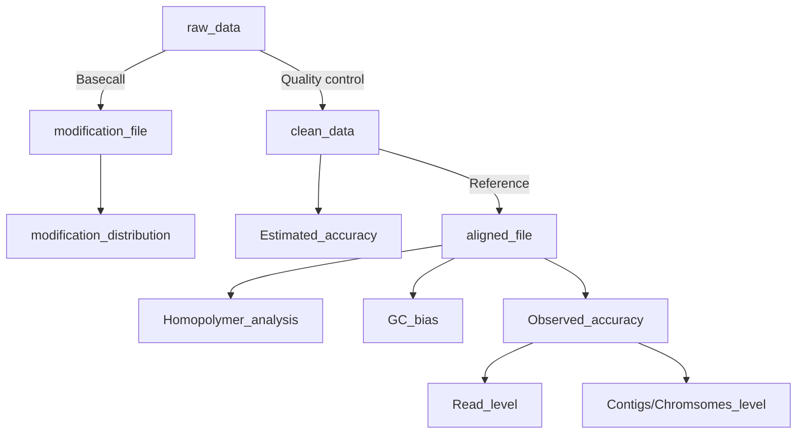

**Giraffe_View** is designed to help assess and visualize the accuracy of a sequencing dataset, specifically for Oxford Nanopore Technologies (ONT) long-read sequencing.

**Workflow:**

The update is available [here](https://github.com/lrslab/Giraffe_View).
