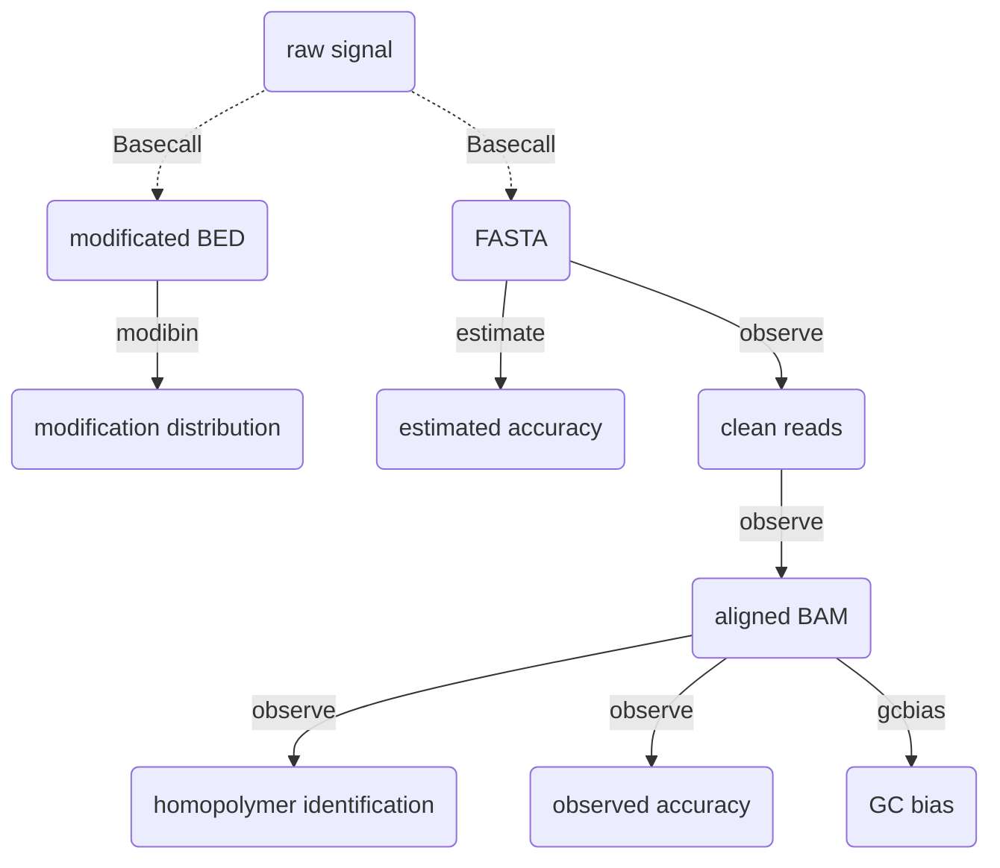

# Giraffe_View 

**Giraffe_View** is designed to help assess and visualize the accuracy of a sequencing dataset, specifically for Oxford Nanopore Technologies (ONT) long-read sequencing including DNA and RNA data. There are four main functions to validate the read quality.

- `observe`  calculates the observed read accuracy, mismatches porportion, and homopolymer identification.
- `estimate`  calculates the estimated read accuracy, which is equal to Quality Score.
- `gcbias`  compares the relationship between GC content and read coverage.
- `modibin` perform statistics on the distribution of modification based on the bed file.


## Install

To use this software, you need to install additional dependencies including samtools, minimap2, seqkit, and bedtools for read processing. The following commands can help you to install the package  and dependencies.

```shell
pip install Giraffe-View
conda install -c bioconda -c conda-forge samtools minimap2 seqkit bedtools -y
```


## General Usage

Giraffe View is run simply with fllowing commands:

```
usage: giraffe [-h] {observe,estimate,gcbias,modibin} ...

A tool to help you assess quality of ONT data.

positional arguments:
  {observe,estimate,gcbias,modibin}
    observe             Observed quality in accuracy, mismatch, and homopolymer identification
    estimate            Estimated read accuracy
    gcbias              Relationship between GC content and depth
    modibin             Average modification proportion of bins

optional arguments:
  -h, --help            show this help message and exit
```


The available sub-commands are:

#### observe

```
giraffe observe -h
usage: giraffe observe [-h] --input <fastq> --ref <reference> [--cpu <number>] [--plot]

optional arguments:
  -h, --help         show this help message and exit
  --input <fastq>    input reads
  --ref <reference>  input reference
  --cpu <number>     number of cpu (default:10)
  --plot             Results visualization
```

- `fastq` - the raw fastq data, some filter steps will be conducted including short read ( < 200 bp) and low quality read ( < 7 ) removal.
- `reference` - the reference file in fasta format.
- `cpu` - the number of CPUs will be used during processing.


#### estimate  

```
giraffe estimate -h
usage: giraffe estimate [-h] --input <fastq> [--cpu <number>] [--plot]

optional arguments:
  -h, --help       show this help message and exit
  --input <fastq>  input reads
  --cpu <number>   number of cpu (default:10)
  --plot           Results visualization
```


#### gcbias

```
giraffe gcbias -h
usage: giraffe gcbias [-h] --ref <reference> --input <sam/bam> [--binsize] [--plot]

optional arguments:
  -h, --help         show this help message and exit
  --ref <reference>  input reference file
  --input <sam/bam>  input bam/sam file
  --binsize          input bin size (default:1000)
  --plot             Results visualization
```

- `reference` - the reference file in fasta format.
- `sam` / `bam` - the result of mapping in sam/bam file. If you have used the observe function to process your data, the resulting `tmp.sort.bam` file can be used as the input.
- `binsize` - the length of bin. A bin is the smallest unit to count the read coverage and GC content.


#### modibin

```
giraffe modibin -h
usage: giraffe modibin [-h] --input <bed> --ref <reference> [--cpu <number>] [--plot]

optional arguments:
  -h, --help         show this help message and exit
  --input <bed>      input modificated bed file, please use the .bed as the file suffix
  --ref <reference>  input position file with CSV format, please use the .csv as the file suffix
  --cpu <number>     number of cpu (default:10)
  --plot             Results visualization
```

- `bed` -  a BED file with four columns (three columns for position, one for methylation proportion).  Please use the tab ("\t") to gap the column instead of the space (" ").

   ```
   #chrom	start	end	value
   chr1	81	83	0.8
   chr1	21314	21315	0.3
   chr1	32421	32422	0.85
   ```

- `reference` - a CSV file with target regions.

   ```
   chr1,0,100000,1_0_100000
   chr1,100000,200000,1_100000_200000
   ```


## Results 

if you run the demo data in the example, you will obtain a fold named **results** with following structure.

```
results/
├── estimated_quality
│   ├── estimated_read_accuracy.pdf
│   └── final_estimated_accuracy.txt
├── GC_bias
│   ├── BIN.bed
│   ├── bin_distribution.pdf
│   ├── BIN.dp
│   ├── final_GC_bias_nor.txt
│   ├── GC_bias.pdf
│   ├── GC_bias_raw.txt
│   └── GC_content.txt
├── observed_quality
│   ├── clean.fastq
│   ├── final_homo_summary.txt
│   ├── final_observed_accuracy.txt
│   ├── homo_tmp.txt
│   ├── homo.txt
│   ├── Observed_homopolymer_identification.pdf
│   ├── Observed_mismatch_proportion.pdf
│   ├── Observed_read_accuracy.pdf
│   ├── tmp.sort.bam
│   └── tmp.sort.bam.bai
└── regional_modification
    ├── motif_bin_box.pdf
    ├── motif_bin_violin.pdf
    └── zebraFish_5mC_zebraFish_promoter.bed
```


### estimated_quality

`final_estimated_accuracy.txt` - Estimated read accuracy with read ID, estimated read accuracy, estimate read error, and Q-Score for each read.

`estimated_read_accuracy.pdf` -  Visualization of estimated read accuracy.


### observed_quality

`clean.fastq` - Clean reads after some filter steps including short read ( < 200 bp) and low quality read ( < 7 ) removal.

`tmp.sort.bam` - Aligned BAM file using clean reads against reference. 

`tmp.sort.bam.bai` - Index for BAM file.

`homo.txt` - Detailed information for homopolymer identification including chromosome, start, end, length of homopolymer, base type of homopolymer, base matched  number, base deletion  number, base insertion number, base substitution number, and read ID in each read.

`homo_tmp.txt` - Summarized information including position of homopolymer in reference, number of perfectly matched read, total number of mapped read, and homopolymer feature. 

`final_observed_accuracy.txt` - Summary of observed read accuracy including read ID, insertion length, deletion length, substitution length, matched length, observed identification rate, and observed read accuracy.

` final_homo_summary.txt` - Accuracy of homopolymer for each base type.

`Observed_homopolymer_identification.pdf` - Visualization of accuracy of homopolymer identification.

`Observed_mismatch_proportion.pdf` - Visualization of mismatch proportion.

`Observed_read_accuracy.pdf` - Visualization of observed read accuracy.


### GC_bias

`BIN.bed` - BIN position (chromosome, start, end) .

`BIN.dp` - Base  depth for each BIN.

`GC_content.txt`  - GC content for each BIN.

`GC_bias_raw.txt`  - Average depth and BIN number at each GC content.

`final_GC_bias_nor.txt` - Normalized read coverage  at each GC content .

`bin_distribution.pdf` - Visualization of number of BIN at each GC content.

`GC_bias.pdf` - Visualization of relationship between normalized depth and GC content.


### regional_modification

`zebraFish_5mC_zebraFish_promoter.bed` - Average modification proportion for each bin. Here, it is the average 5mC proportion at promoter level. 

`motif_bin_violin.pdf` - Distribution of modification proportion.

`motif_bin_box.pdf` - Box plot of  modification proportion.


## Workflow




## Developing

- run the homopolymer identification with multi processes.
