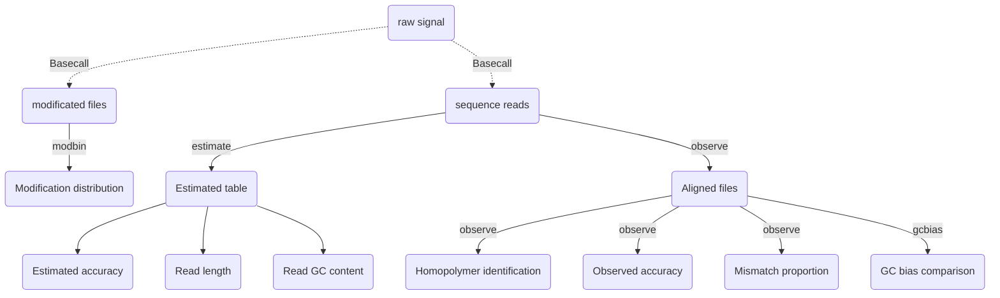

**Giraffe_View** is specially designed to provide a comprehensive assessment of the accuracy of long-read sequencing datasets obtained from both the PacBio and Nanopore platforms. 


- `estimate`  Calculation of estimated read accuracy (Q score), length, and GC content. 

- `observe`  Calculation of observed read accuracy, mismatch proportion, and homopolymer identification (e.g. AAAA).
- `gcbias`  Calculation of the relationship between GC content and sequencing depth.
- `modbin` Calculation of the distribution of modification (e.g. 5mC or 6mA methylation) at the regional level.


# Installation

Before using this tool, you need to install additional dependencies for read processing, including the [samtools](https://www.htslib.org/)，[minimap2](https://github.com/lh3/minimap2), and [bedtools](https://github.com/arq5x/bedtools2). The following commands can help you install both the software package and its dependencies.

```shell
conda install -c bioconda -c conda-forge samtools minimap2 bedtools -y
pip install Giraffe-View
```

If you are unfamiliar with the process of installing `conda`, you can refer to the official conda documentation for detailed instructions. Please follow [this link](https://conda.io/projects/conda/en/latest/user-guide/install/index.html) for guidance on installing conda.


# General Usage

The `giraffe` can be run using following  commands:

```shell
giraffe -h
```

```shell
usage: giraffe [-h] {estimate,observe,gcbias,modbin} ...

A tool to help you assess the quality of long-read sequencing data.

positional arguments:
  {estimate,observe,gcbias,modbin}
    estimate            Estimated accuracy, length, and GC content.
    observe             Observed accuracy, mismatch proportion, and homopolymer identification.
    gcbias              Relationship between GC content and sequencing depth.
    modbin              Average modification proportion at regional level.

optional arguments:
  -h, --help            show this help message and exit
```


The available sub-commands are:


## estimate  

```shell
giraffe estimate -h
```

```shell
usage: giraffe estimate [-h] --input <file list> [--cpu <number>] [--plot]

options:
  -h, --help           show this help message and exit
  --input <file list>  input the file list
  --cpu <number>       number of cpu (default:10)
  --plot               results visualization
```

`file list` - a table with your sample ID, sequencing platforms (ONT/Pacbio), and path of your datasets **(FASTQ format)**, please using the SPACE(" ") to gap them.

`cpu` - number of CPUs will be used during processing.

```shell
# A example of file list
R1 ONT test/reads/S1.fastq
R2 Pacbio test/reads/S2.fastq
R3 ONT test/reads/S3.fastq
```


## observe

```shell
giraffe observe -h
```

```shell
usage: giraffe observe [-h] --input <file list> --ref <reference> [--cpu <number>] [--plot]

optional arguments:
  -h, --help           show this help message and exit
  --input <file list>  input the file list
  --ref <reference>    input reference
  --cpu <number>       number of CPU (default:10)
  --plot               results visualization
```

- `file list` - a table same with the above one.
- `reference` - reference file in FASTA format.
- `cpu` - number of CPUs will be used during processing.


## gcbias

```shell
giraffe gcbias -h
```

```shell
usage: giraffe gcbias [-h] --ref <reference> --input <list> [--binsize] [--plot]

optional arguments:
  -h, --help         show this help message and exit
  --ref <reference>  input reference file
  --input <list>     input the list of bam/sam file
  --binsize          input bin size (default:1000)
  --plot             results visualization
```

- `file list` - a table with your sample ID, sequencing platforms (ONT/Pacbio), and path of your alignment files **(sam/bam format)**, please using the SPACE(" ") to gap them. 

  **P.S.** If you have used the observe function to process your data, the resulting bam file can be used as the input.

- `reference` - the reference file.

- `binsize` - the length of BIN. The BIN is the unit to count the read coverage and GC content (e.g. 3000 or 5000).

```shell
# A example of file list
R1 ONT test/reads/S1.bam
R2 Pacbio test/reads/S2.bam
R3 ONT test/reads/S3.bam
```


## modbin

```shell
giraffe modbin -h
```

```shell
usage: giraffe modbin [-h] --input <list> --bed <reference> [--cpu <number>] [--plot]

optional arguments:
  -h, --help         show this help message and exit
  --input <list>     input list of modificated file
  --bed <reference>  input position file with CSV format
  --cpu <number>     number of CPU (default:10)
  --plot             results visualization
```

- `list` - a table with your sample ID, sequencing platforms (ONT/Pacbio), and path of your files with methylation information, please using the SPACE(" ") to gap them. 

- ```shell
   # A example of file list
   R1 ONT test/reads/5mC_S1.txt
   R2 Pacbio test/reads/5mC_S2.txt
   R3 ONT test/reads/5mC_S3.txt
   
   # A example of your methylation file with four columns (three columns for position, one for methylation value).  
   # Please use the tab ("\t") to gap the column instead of the space (" ").
   # chrom	start	end	value
   chr1	81	83	0.8
   chr1	21314	21315	0.3
   chr1	32421	32422	0.85
   ```

- `reference` - a CSV file with target regions (chromosome, start, end, ID)

   ```shell
   chr1,0,100000,bin1
   chr1,100000,200000,bin2
   ```


# Results 

if you run the demo data in the example, you will obtain a fold named **Giraffe_Results** with following structure.

```shell
Giraffe_Results/
├── 1_Estimated_quality
│   ├── 1_Read_accuracy.pdf
│   ├── 2_Read_length.pdf
│   ├── 3_Read_GC_content.pdf
│   └── Estimated_information.txt
├── 2_Observed_quality
│   ├── 1_Observed_read_accuracy.pdf
│   ├── 2_Observed_mismatch_proportion.pdf
│   ├── 3_Homoploymer_summary.pdf
│   ├── Homoploymer_summary.txt
│   ├── Observed_information.txt
│   ├── R1041.bam
│   ├── R1041.bam.bai
│   ├── R1041_homopolymer_detail.txt
│   ├── R1041_homopolymer_in_reference.txt
│   ├── R941.bam
│   ├── R941.bam.bai
│   ├── R941_homopolymer_detail.txt
│   └── R941_homopolymer_in_reference.txt
├── 3_GC_bias
│   ├── 1_Bin_distribution.pdf
│   ├── 2_Relationship_normalization.pdf
│   ├── Bin_distribution.txt
│   ├── R1041_relationship_raw.txt
│   ├── R941_relationship_raw.txt
│   └── Relationship_normalization.txt
└── 4_Regional_modification
    ├── 1_Regional_modification.pdf
    ├── Blood.bed
    └── Kidney.bed
```


## 1_Estimated_quality

- `Estimated_information.txt` -  File with read ID, estimated read accuracy, estimate read error, Q Score, GC content, read length and sample ID.

  |  ReadID   | Accuracy | Error | Q_value | Length | GC_content | Group |
  | :-------: | :------: | :---: | :-----: | :----: | :--------: | :---: |
  | @9154e0a0 |  0.935   | 0.065 | 11.857  |  316   |   0.503    | R1041 |
  | @fa8f2a80 |  0.948   | 0.052 | 12.877  |  9621  |   0.498    | R1041 |

- `1_Read_accuracy.pdf` - Distribution of estimated read accuracy **(Fig A)**.

- `2_Read_length.pdf` - Distribution of read length **(Fig B)**.

- `3_Read_GC_content.pdf` - Distribution of read GC content **(Fig C)**.


## 2_Observed_quality

- `Homoploymer_summary.txt` - Accuracy of identification for each homopolymer type (only the length over 3 base pair was calculated, e.g. AAAA and TTTTT).

  | Base | Accuracy | Group |
  | :--: | :------: | :---: |
  |  T   |  0.909   | R1041 |
  |  G   |  0.857   | R1041 |
  |  A   |  0.907   | R1041 |
  |  C   |  0.859   | R1041 |

  

- `Observed_information.txt` - Summary of observed accuracy includes the read ID, insertion length, deletion length, substitution length, matched length, observed identification rate, observed accuracy, and sample ID for each read.

  |    ID    | Ins  | Del  | Sub  | Mat  |  Iden  |  Acc   | Group |
  | :------: | :--: | :--: | :--: | :--: | :----: | :----: | :---: |
  | 70fbffe6 |  3   |  1   |  1   | 354  | 0.9972 | 0.9861 | R1041 |
  | 96a5c10b |  3   |  11  |  2   | 342  | 0.9942 | 0.9553 | R1041 |

- `XXX_homopolymer_detail.txt` - Detailed information for homopolymer identification includes the chromosome, start position, end position, homopolymer  length, homopolymer type , matched base number, deleted base number, inserted base number, substituted base number, read ID, and sample ID (Read level).

  |    Chrom    | Start | End  | length | type | Matched base | Deleted base | Inserted base | Substituted  base |  ReadID  | SampleID |
  | :---------: | :---: | :--: | :----: | :--: | :----------: | :----------: | :-----------: | :---------------: | :------: | :------: |
  | ecoli_chrom | 3083  | 3086 |   4    |  T   |      4       |      0       |       0       |         0         | c322bcea |   R941   |
  | ecoli_chrom | 3382  | 3386 |   5    |  A   |      5       |      0       |       0       |         0         | c322bcea |   R941   |

- `XXX_homopolymer_in_reference.txt` - Summarized information includes the position of homopolymer in reference,  the number of perfectly matched read, the total number of mapped read, the homopolymer feature, and sample ID (Reference level). 

  |          pos          | num_of_mat | depth | type | Group |
  | :-------------------: | :--------: | :---: | :--: | :---: |
  | ecoli_chrom_3083_3086 |     1      |   1   |  4T  | R941  |
  | ecoli_chrom_3382_3386 |     1      |   1   |  5A  | R941  |

- `XXX.bam` - BAM file generated by aligning the data against the reference genome.

- `XXX.bam.bai` - Index for BAM file.

- `1_Observed_read_accuracy.pdf` - Distribution of observed read accuracy **(Fig A)**.

- `2_Observed_mismatch_proportion.pdf` - Distribution of mismatch proportion **(Fig B)**.

- `3_Homoploymer_summary.pdf` - Accuracy of homopolymer identification **(Fig C)**.


## 3_GC_bias

- `Bin_distribution.txt` - BINs number within each GC content. (GC content,  and Number of BINs)

- `XXXX_relationship_raw.txt` - Read coverage for total GC content (GC content, average depth among the BINs, number of BINs, and  sample ID).

- `Relationship_normalization` - Normalized read coverage for selected GC content (GC content, average depth, Number of BINs, sample ID, and normalized depth).

  | GC_content | Depth | Number | Group | Normalized_depth |
  | :--------: | :---: | :----: | :---: | :--------------: |
  |     40     | 7.832 |   55   | R1041 |      1.066       |
  |     41     | 7.655 |   59   | R1041 |      1.067       |

- `1_Bin_distribution.pdf` - Visualization of BINs number within each GC content **(Fig A)**.

- `2_Relationship_normalization.pdf` -  Relationship between normalized depth and GC content **(Fig B)**.


## 4_Regional_modification

- `XXX.bed` -  Average modification proportion for each BIN (BIN name, average value, and sample ID).

  |      BIN name      | 5mC proportion | Group |
  | :----------------: | :------------: | :---: |
  | ENSDARG00000102097 |      0.6       | Blood |
  | ENSDARG00000099319 |     0.830      | Blood |

- `1_Regional_modification.pdf`


# Workflow


