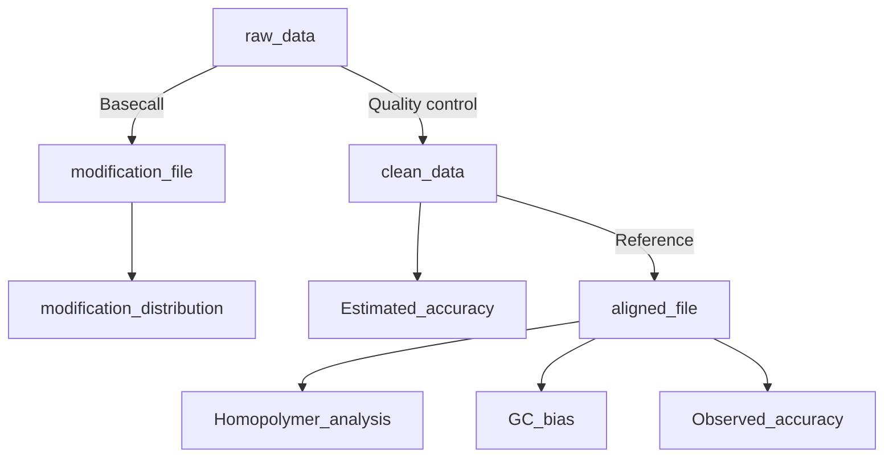

# Giraffe_View 

**Giraffe_View** is designed to help assess and visualize the accuracy of a sequencing dataset, specifically for Oxford Nanopore Technologies (ONT) long-read sequencing including DNA and RNA data. There are four main functions to validate the read quality.

- `observe`  calculates the observed read accuracy, mismatches porportion, and homopolymer identification.
- `estimate`  calculates the estimated read accuracy, which is equal to Quality Score.
- `GC_bias`  compares the relationship between GC content and read coverage.
- `modi` perform statistics on the distribution of modification based on the bed file.


## Install

To use this software, you will need to install additional dependencies including samtools, minimap2, seqkit, pysam, numpy, and pandas. You can install these dependencies using the following command.

```shell
pip install rpy2==3.0 pysam numpy pandas
conda install -c bioconda -c conda-forge samtools minimap2 seqkit -y
```


## General Usage

Giraffe View is run simply with fllowing commands:

```shell
python Giraffe_View.py --help
```

```shell
usage: Giraffe_view [-h] {observe,modi,GC_bias,estimate} ...

A tool to help you assess quality of your ONT data.

positional arguments:
  {observe,modi,GC_bias,estimate}
    observe             Observed quality in accuracy, mismatch, and homopolymer
    modi                Average modification proportion of regions
    GC_bias             Relationship between GC content and depth
    estimate            Estimated read accuracy

optional arguments:
  -h, --help            show this help message and exit
```


The available sub-commands are:

### observe

```shell
python Giraffe_View.py observe --help
```

```xshell
usage: Giraffe_view observe [-h] --input <fastq> --ref <reference> [--cpu <number>]

optional arguments:
  -h, --help         show this help message and exit
  --input <fastq>    input reads
  --ref <reference>  input reference
  --cpu <number>     number of cpu (default:10)
```

- `fastq` - the raw fastq data, some filter steps will be conducted including short read ( < 200 bp) and low quality read ( < 7 ) removal.
- `reference` - the reference file in fasta format.
- `cpu` - the number of CPUs will be used during processing.


### estimate  

```shell
python Giraffe_View.py estimate --help
```

```shell
usage: Giraffe_view estimate [-h] --input <fastq> [--cpu <number>]

optional arguments:
  -h, --help       show this help message and exit
  --input <fastq>  input reads
  --cpu <number>   number of cpu (default:10)
```


### GC_bias

```shell
python Giraffe_View.py GC_bias --help
```

```shell
usage: Giraffe_view GC_bias [-h] --ref <reference> --input <sam/bam> [--binsize]

optional arguments:
  -h, --help         show this help message and exit
  --ref <reference>  input reference file
  --input <sam/bam>  input bam/sam file
  --binsize          input bin size (default:1000)
```

- `reference` - the reference file in fasta format.
- `sam` / `bam` - the result of mapping in sam/bam file. If you have used the observe function to process your data, the resulting `tmp.sort.bam` file can be used as the input.
- `binsize` - the length of bin. A bin is the smallest unit to count the read coverage and GC content.


### modi

```shell
python Giraffe_View.py modi --help
```

```shell
usage: Giraffe_view modi [-h] --input <bed> --ref <reference> [--cpu <number>]

optional arguments:
  -h, --help         show this help message and exit
  --input <bed>      input bed file
  --ref <reference>  input reference
  --cpu <number>     number of cpu (default:10)
```

- `bed` -  a bed file with four columns (three columns for position, one for methylation proportion).  Please use the tab ("\t") to gap the column instead of the space (" ").

   ```shell
   #chrom	start	end	value
   chr1	81	83	0.8
   chr1	21314	21315	0.3
   chr1	32421	32422	0.85
   ```

- `reference` - a csv file with target regions.

   ```shell
   chr1,0,100000,1_0_100000
   chr1,100000,200000,1_100000_200000
   ```


## Workflow




## Developing

- A example to show how to run
- polish the result figures
- run the homopolymer identification with multi-processes
